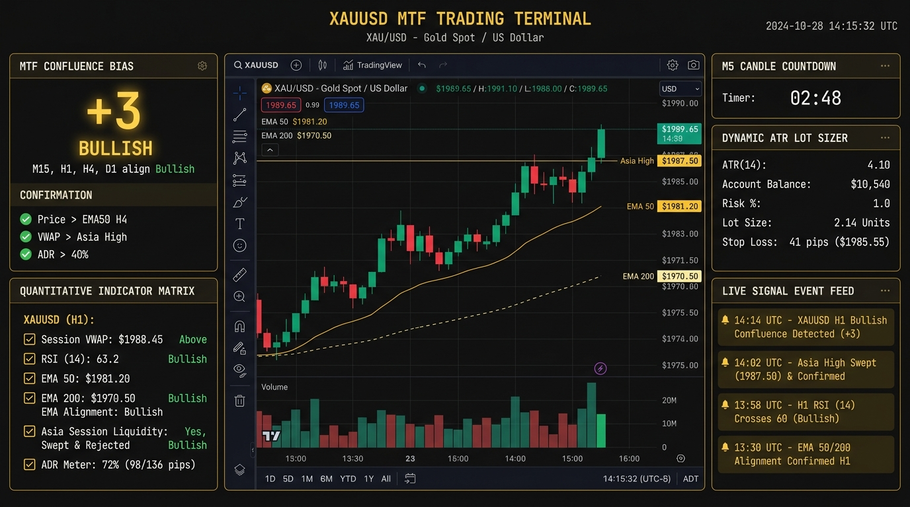

# Real-Time XAUUSD Multi-Timeframe Trading Terminal

A high-performance, real-time trading terminal designed specifically for **XAUUSD (Gold)** multi-timeframe analysis across **H1 (Macro Bias)**, **M15 (Structure & Momentum)**, and **M5 (Execution & Liquidity Triggers)**.



## Key Features

- **TradingView Lightweight Charts v4**: Clean candlestick chart with 2x zoom-out perspective, subtle 1px EMA 50 & EMA 200 trendlines, bottom volume histogram sub-pane, and interactive cursor crosshair with local timezone formatting.
- **Quantitative Indicator Matrix & Interpretations**: Actionable plain-English technical breakdowns for Session VWAP, RSI (14) momentum & divergence, EMA trend stacks, Asian Range liquidity sweeps, and Average Daily Range (ADR).
- **Liquidity & Structure Engine**: Automated Asian Session Range (00:00 - 08:00 UTC), Asia High/Low sweeps, PDH/PDL sweeps, and M5 Fair Value Gaps (FVG).
- **Macro & News Correlation**: Live DXY and US10Y tracking, active session killzones, and high-impact USD economic calendar countdown with $< 15\text{m}$ volatility guard.
- **Dynamic ATR Risk & Lot Sizer**: Real-time position sizing calculated from $1.5\times\text{ATR}_{M5}$, customizable account balance, and configurable risk percentage.
- **Real-Time Streaming Backend (`FastAPI` + `WebSockets`)**: Low-latency market feed with 48-hour continuous historical depth and automatic gap bridging.

## Quick Start

1. **Activate Virtual Environment:**
   ```bash
   source .venv/bin/activate
   ```
2. **Launch Terminal:**
   ```bash
   python3 scripts/start_dashboard.py
   ```
3. **Open in Browser:**
   Navigate to [http://127.0.0.1:8000](http://127.0.0.1:8000)

## Running Automated Tests
```bash
.venv/bin/pytest -v tests/
```

## Architecture & Design
- `docs/architecture.md`: Data flow, WebSocket schemas, and multi-timeframe engine specifications.
- `docs/design.md`: Deep Dark Financial Terminal design system (colors, typography, components).
- `docs/tasks.md`: Task tracker and step state.
